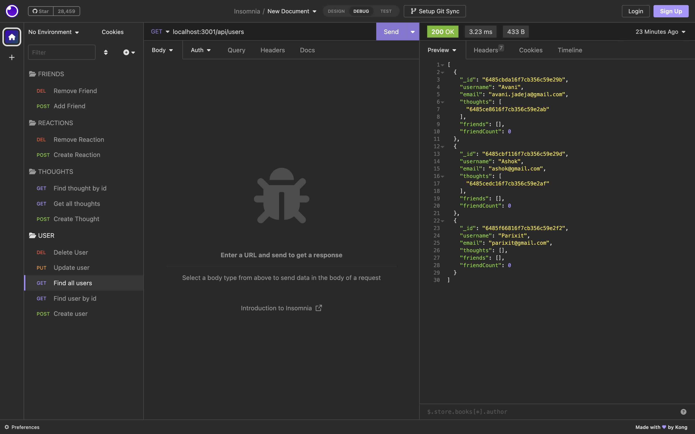
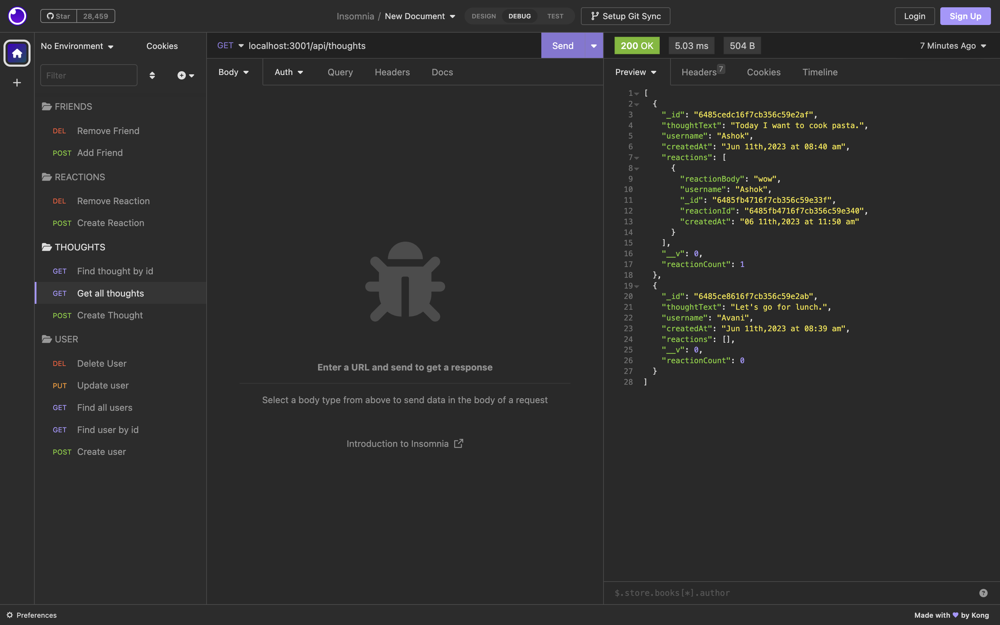
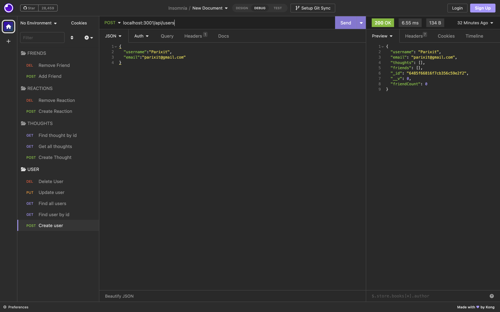
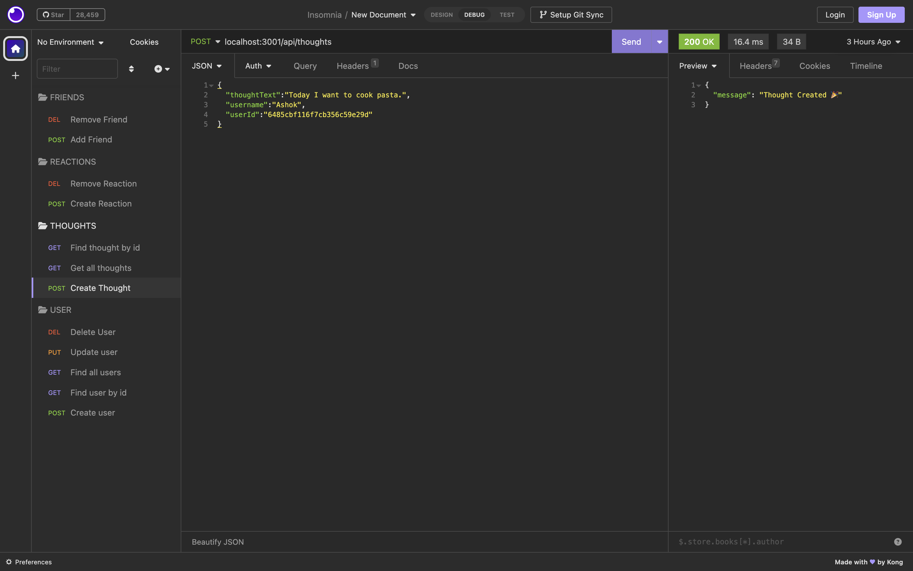
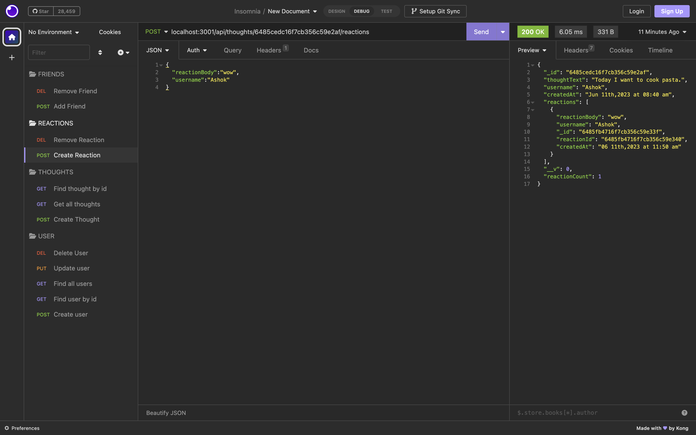
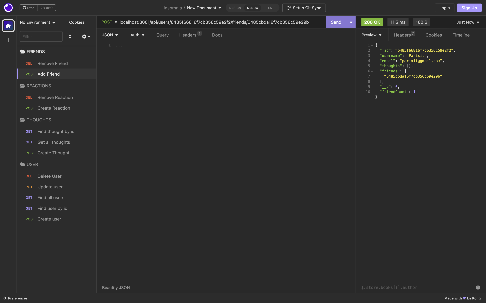
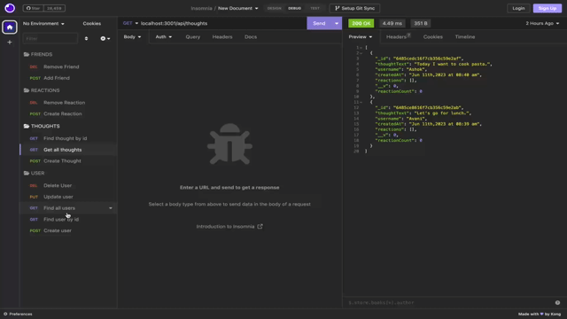
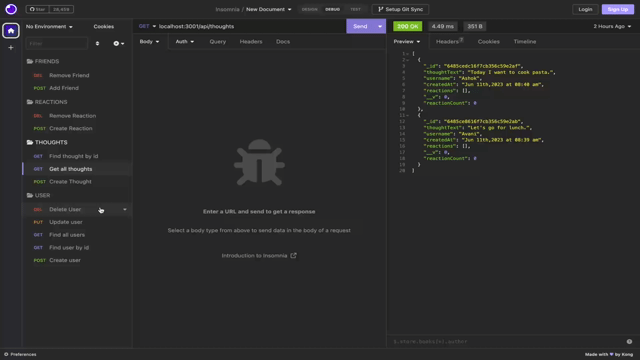

# social-network-api

Social Network API for a social network web application where users can share their thoughts, react to friends’ thoughts, and create a friend list.

# Description.

Social Network API is for a social network web application where users can share their thoughts,react to friend's thoughts and create a friend list.In this application I used express.js for routing, a MongoDB database, and the Mongoose ODM.Here I used moment date library to modify current date format.using MongoDB this application can handle large amounts of unstructured data.

In this Social Network API,

- WHEN User enter the command to invoke the application, THEN server is started and the Mongoose models are synced to the MongoDB database.

- WHEN User open API GET routes in Insomnia for users and thoughts,THEN the data for each of these routes is displayed in a formatted JSON.

- WHEN User test API POST, PUT, and DELETE routes in Insomnia,THEN User able to successfully create, update, and delete users and thoughts in my database.

- WHEN User test API POST and DELETE routes in Insomnia,THEN User able to successfully create and delete reactions to thoughts and add and remove friends to a user’s friend list.

- WHEN User delete paticular user, THEN for that particular user assoicated thought also deleted.

So through application, I learned mongodb, mongoose, express, moment so now I can now make application with mongodb.mongoose and express.

# Table of Contents

- [Installation](#installation)
- [Usage](#usage)
- [Credits](#credits)
- [License](#license)

# Installation

This Social Network API,

- first user have to do npm init -y to generate package.json file.

- Then using npm install, User first have to install express,moment,mongodb,mongoose.

- Then using npm run start user can start application.

# Usage

A walkthrough video demonstrating the functionality of the application - https://drive.google.com/file/d/1JlPLfVbdwa_GlckSDAT2WtbMNwAAD46S/view?usp=sharing

The URL of the GitHub repository - https://github.com/avanijadeja/social-network-api

# Credits

- https://mongoosejs.com/docs/guide.html

- https://www.mongodb.com/docs/

- https://devdocs.io/express/

- https://momentjs.com/

# License

This project is using the MIT License.

# Badges

